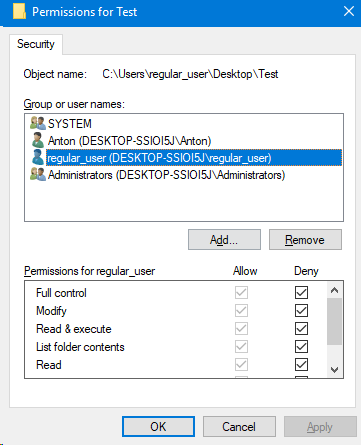

# Lucrarea de laborator Nr.1 la Securitatea

A elaborat: **Curmanschii Anton, IA1901**

- [Lucrarea de laborator Nr.1 la Securitatea](#lucrarea-de-laborator-nr1-la-securitatea)
  - [Introducere](#introducere)
  - [Sarcina 1.](#sarcina-1)
  - [Sarcina 2](#sarcina-2)

## Introducere

Am un laptop pe Windows 10. Am un cont de administrator al meu la care am acces — Anton.

## Sarcina 1.

a) Să se creeze două utilizatori noi: 
- `regular_user` care să aibă drepturile a unui utilizator fără privilegii speciale;
- `user_admin` care să aibă privilegii speciale de administrator.

În Windows 10 putem crea utilizatori noi fiind logat ca administrator printr-un meniu special.
Am dat users în search pentru a găsi acest meniu:

Aici avem un meniu special care arată utilizatorii și butonul pentru a crea utilizatori noi.
Butonul ne trece printr-un wizard ușor de înțeles.

Aici am creat acei 2 utilizatori și i-am dat privilegiile corespunzătoare:

b) Să se creeze un folder `Test` și la Security să resticte accesul la acest folder pentru `regular_user`.

Dacă încercăm să creăm acest folder într-un loc pe sistem de fișiere unde utilizatorul normal deja nu are acces, el nici nu apare în lista de utilizatori în meniul Security (sunt logat din contul meu Anton):

Însă dacă creez de exemplu un folder pe desktop-ul utilizatorului `regular_user`, atunci apare.

Putem apăsa edit și schimba privilegiile (am bifat *Deny* pe toate):

Acum ne relogăm ca `regular_user` și încerăm să accesăm fișierul. Ne dă o eroare de permisiune:

## Sarcina 2

În sarcina se cere ca utilizatorul `regular_user` să fie în grupul Users și să se modifică întregul grup, însă în exemplul de mai sus am modificat permisiunile doar acelui singur utilizator.

Pentru a accesa grupurile în Windows cautăm `Computer Management` în search. Deschidem aplicația.

Aici putem accesa grupurile în `Local Users and Groups` -> `Groups`. 
Aici găsim și grupul Users care deja îi conține pe ambii utilizatori noi.

Momentul interesant este că grupul Users nu apare în Security la un folder nou, dar apare pentru folderi care au existat înainte.

Aici am create un folder Test nou ca utilizator pe discul E, și nu avem acest grup în Security:

Iar dacă configurez un folder creat în prealabil, Users apare:

Vom face același lucru la, zicem, mapa Steam, la care Users totuși apare.
În Security anulăm permisiunile pentru grupul Users:

Windows-ul începe să schimbe individual toate subfișierile și submapele. Opresc.

Am găsit cum să adaug grupurile în lista grupurilor vizibile pentru un obiect (fișier sau folder) dat.
În meniul Security selectăm Edit și Add. Apare meniul de selectare a entității de adăugat (un utilizator sau un grup):

Aici scriem numele grupurii în text area.

În advanced putem selecta un utilizator sau un grup șă să apăsăm Edit. Apare așa meniu unde se poate customiza ce vrem. 
Înțeleg că din acest meniu deja aplicăm setările la toata ierarhie de folderi și fișiere, deci Windows-ul nu va încerca să schimbe proprietățile la fiecare obiect individual.

Deci la moment utilizatorii au permisiunile de citire, dar nu de scriere. 
Însă ei sunt și în alte grupuri, de aceea pentru a anula una sau mai multe din permisiuni, trebuie să punem Deny în loc de Allow.
Meniul Advanced dintr-o oarecare cauză nu permite să setez Deny, însă meniul normal permite.

Verificăm.

Lucrează cum am anticipat.

a) Efectuați din nou comutarea utilizatorilor. Sub contul de `cont_administrator` adauga la lista 
de utilizatori accesul la fișiere pentru contul `cont_utilizator` și dați-i permisiunea de a efectua 
modificări (Modify). Încercați din nou să creați folderul.

Deselectam Deny la Read la Users. Acum `regular_user` ar trebui să putea să deschidă folderul, dar nu să scrie.

Nu contează ce anume permisiune îi dăm, va lucra asemănător și cu Modify șu cu Write. Ideea am demonstrat-o.

Aici ca să înțeleg mai bine am decis să citesc . 
[Aici](https://www.tenforums.com/tutorials/88305-enable-disable-inherited-permissions-objects-windows.html) se descrie moștenirea. Se dovedește că este opțională.