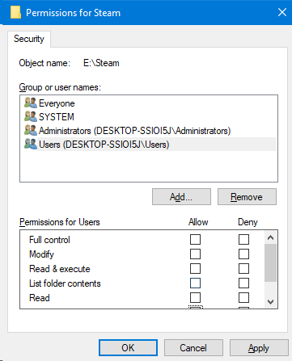

# Lucrarea de laborator Nr.1 la Securitatea SO

A elaborat: **Curmanschii Anton, IA1901**

- [Lucrarea de laborator Nr.1 la Securitatea SO](#lucrarea-de-laborator-nr1-la-securitatea-so)
  - [Introducere](#introducere)
  - [Sarcina 1](#sarcina-1)
  - [Sarcina 2](#sarcina-2)
  - [Sarcina 3](#sarcina-3)
  - [Sarcina 4](#sarcina-4)
  - [Sarcina 5](#sarcina-5)
  - [Concluzii](#concluzii)

## Introducere

Am un laptop pe Windows 10. Am un cont de administrator al meu la care am acces — Anton.

## Sarcina 1

> a) Să se creeze două utilizatori noi: 
> - `regular_user` care să aibă drepturile a unui utilizator fără privilegii speciale;
> - `user_admin` care să aibă privilegii speciale de administrator.

În Windows 10 putem crea utilizatori noi fiind logat ca administrator printr-un meniu special.
Am dat users în search pentru a găsi acest meniu:

Aici avem un meniu special care arată utilizatorii și butonul pentru a crea utilizatori noi.
Butonul ne trece printr-un wizard ușor de înțeles.

Aici am creat acei 2 utilizatori și i-am dat privilegiile corespunzătoare:

> b) Să se creeze un folder `Test` și la Security să resticționeze accesul la acest folder pentru `regular_user`.

Dacă încercăm să creăm acest folder într-un loc pe sistem de fișiere unde utilizatorul normal deja nu are acces, el nici nu apare în lista de utilizatori în meniul Security (sunt logat din contul meu Anton):

Însă dacă creez de exemplu un folder pe desktop-ul utilizatorului `regular_user`, atunci apare.

Putem apăsa edit și schimba privilegiile (am bifat *Deny* pe toate):

Acum ne relogăm ca `regular_user` și încerăm să accesăm fișierul. Ne dă o eroare de permisiune:

## Sarcina 2

> În sarcina se cere ca utilizatorul `regular_user` să fie în grupul Users și să se modifice întregul grup, însă în exemplul de mai sus am modificat permisiunile doar acelui singur utilizator.

Pentru a accesa grupurile în Windows cautăm `Computer Management` în search. Deschidem aplicația.

Aici putem accesa grupurile în `Local Users and Groups` -> `Groups`. 
Aici găsim și grupul Users care deja îi conține pe ambii utilizatori noi.

Momentul interesant este că grupul Users nu apare în Security la un folder nou, dar apare pentru folderi care au existat înainte.

Aici am create un folder Test nou ca utilizator pe discul E, și nu avem acest grup în Security:

Iar dacă configurez un folder creat în prealabil, Users apare:

Vom face același lucru la, zicem, mapa Steam, la care Users totuși apare.
În Security anulăm permisiunile pentru grupul Users:

Windows-ul începe să schimbe individual toate subfișierile și submapele. Opresc.

Am găsit cum să adaug grupurile în lista grupurilor vizibile pentru un obiect (fișier sau folder) dat.
În meniul Security selectăm Edit și Add. Apare meniul de selectare a entității de adăugat (un utilizator sau un grup):

Aici scriem numele grupurii în text area.

În advanced putem selecta un utilizator sau un grup șă să apăsăm Edit. Apare așa meniu unde se poate customiza ce vrem. 
Înțeleg că din acest meniu deja aplicăm setările la toata ierarhie de folderi și fișiere, deci Windows-ul nu va încerca să schimbe proprietățile la fiecare obiect individual.

Deci la moment utilizatorii au permisiunile de citire, dar nu de scriere. 
Însă ei sunt și în alte grupuri, de aceea pentru a anula una sau mai multe din permisiuni, trebuie să punem Deny în loc de Allow.
Meniul Advanced dintr-o oarecare cauză nu permite să setez Deny, însă meniul normal permite.

Verificăm.

Lucrează cum am anticipat.

> a) Efectuați din nou comutarea utilizatorilor. Sub contul de `cont_administrator` adauga la lista 
> de utilizatori accesul la fișiere pentru contul `cont_utilizator` și dați-i permisiunea de a efectua 
> modificări (Modify). Încercați din nou să creați folderul.

Deselectăm Deny la Read la Users. Acum `regular_user` ar putea să deschidă folderul, dar nu a scrie.

Nu contează ce anume permisiune îi dăm, va lucra asemănător și cu Modify șu cu Write. Ideea am demonstrat-o.

Aici ca să înțeleg mai bine am decis să citesc [documentarea Microsoft referitor la Security](https://docs.microsoft.com/en-us/windows/security/identity-protection/access-control/access-control). 
[Aici](https://www.tenforums.com/tutorials/88305-enable-disable-inherited-permissions-objects-windows.html) se descrie moștenirea. Se dovedește că este opțională.

## Sarcina 3

> Sub contul `cont_administrator` să ștergem grupul Users. 
> Nu veți putea face acest lucru, va apărea avertismentul că aceste permisiuni sunt moștenite de la obiectul părinte.

Îm cazul meu s-a șters fără nici un advertisment, deoarece am adăugat grupul Users de sine stătător.

Încerc același lucru pentru folderul Photo. 
Tot a trecut fără avertismente.

Încerc același lucru iară cu folderul Test însă cu grupul Everyone. 
Deja a lucrat cum trebuia.

Aceasta s-a întâmplat, deoarece permisiunile pentru Everyone au fost moștenite de la Drive-ul E. 

> În scopul de a anula moștenirea ar trebui în fila Security, să faceți clic pe Advanced. 
> În fereastra apărută se observă că este inclusă proprietatea `Include inheritable permissions from this object's parent`. 

În Windows 10 este un pic diferit. 
`Include inheritable permissions from this object's parent` parcă este schimbat aici la butonul `Disable inheritance`, ceea ce presupune că setarea curentă este `Enable inheritance`.

> Acest lucru înseamnă că obiectul moștenește ACL de la părinte, dar în ACL-ul propriu pot fi adăugate doar pentru permisiuni sau interdicții. 
> Dacă faceți clic pe butonul Edit și resetați această bifă, va apărea întrebarea, 
> ce să se facă cu lista de moștenire - se poate face copiate (Copy) în ACL obiectului, sau să fie eliminat (Eliminate). 
> Cel mai des, pentru a nu se pierde setările, se efectuiază copiere, iar apoi lista este corectată.

Și acum grupul se șterge cu succes:

## Sarcina 4

> După cum s-a menționat mai devreme, în determinarea permisiunilor de acces se iau în vedere activarea sau dezactivarea 
> drepturilor, atât pentru utilizator cît și pentru toate grupurile din care face parte.  
> În scopul de a afla permisul valabil (efectiv), aveți posibilitatea să utilizați fila  Effective Permissions. 
> Tastînd tasta Select, puteți selecta un utilizator sau grup pentru care va fi afișat efectiv persmisiunea. 

Am citit [această sursă](https://www.vyapinsoftware.com/blog/understanding-ntfs-permissions-how-to-report-effective-permissions-on-files-and-folders) pentru a înțelege ce înseamnă Effective Permissions.

> Effective permissions are the resultant permissions a User or a Group has towards an object. Effective permissions are the combination of Explicit and Inherited Permission entries and the restrictive permissions apply while accessing object.

Deci aceasta de fapt înseamnă "permisiunile care se aplică curent".

> Verificați dacă utilizatorul TestUser, la dosarul în care se desfășoară activitatea, a avut permisiunea de a modifica. 
> Verificați rezoluția efectivă curentă.

Cum am așteptat, utilizatorul `regular_user` n-are nici o permisiune, deoarece le primea doar din grupul Everyone.

> Adauga la permisiunile folder-ului lista pentru interzicerea grupului TestGroup, orice acces 
> (selectare Deny permisiunea de Control total).  
> Introduceţi la membrii grupului TestGroup utilizatorul TestUser. 
> Uitaţi-vă soluție eficientă pentru utilizatorul TestUser.

Deci în primul rând este necesar să creăm un grup pentru test adaugând în el utilizatorul `regular_user`.

Am adaugat grupul în lista Security și am selectat Full Control. 
Prin urmare, utilizatorul `regular_user` are acces total la folderul.

Acum am resetat permisiunile apasând Enable inheritance și ștergând ACE-urile copiate anerior.

Acum am adăugat grupul `test_group` și am dat deny la Full Control:

Verificând Effective permissions lui `regular_user` m-am asigurat că n-are acces la folderul.

> Comutaţi-vă la sesiune utilizatorului TestUser. 
> Încercați să deschideți folderul și să creaţi un document. 
> Log off sesiunea TestUser și conectați-vă din nou. 
> Apoi, încercați să deschideți un folder și să creaţi un document. 
> Cum putem explica acest rezultat (indiciu este la începutul descrierii lucrării de laborator)?

Am făcut pașii de mai sus fiind nelogat, dar ideea este că Acces Token-ul acelui utilizator nu va conține informația despre grupul nou până la moment când utilizatorul reloghează, primind un nou Acces Token care deja ar conține această informație.
De aceea, permisiunile grupului `test_group` inițial nu s-ar aplica la utilizator, deci ar putea accesa folderul, datorită grupului Everyone, iar după ce reloghează, deja s-ar aplica permisiunile din `test_group` (Deny full access), deci n-ar putea face nimic cu folderul.

Astfel am înțeles eu.

## Sarcina 5

> Să petrecem transferul proprietăţii grupui TestGroup, care include utilizatorul TestUser. 
> Accesând acest cont, modificați permisiunile, astfel încât TestUser ar putea lucra cu dosarul.

Putem accesa folderul după ce am schimbat permisiunile grupului `test_group`. 
Însă cu toate că proprietarul folderului se consideră utilizatorul `regular_user`, nu este considerat proprietarul imaginii în acest folder, de aceea nu poate s-o acceseze.

Pentru aceasta trebuie să bifăm `Replace owner on subcontainers and objects`, cum se descrie în [această sursă](https://www.laptopmag.com/articles/take-ownership-folder-windows-10-using-file-explorer). Însă eu nu primesc așa opțiune.

## Concluzii

În scopul acestei lucrări de laborator:
- am studiat cum lucrează permisiunile pe Windows; 
- am înțeles conceptele de Access Token, ACL (Access Control List), ACE (Access Control Entry), SID (Security Identifier); 
- am studiat că ele lucrează datorită sistemului de fișiere NTFS care permite informația suplimentară la fiecare obiect;
- am studiat conceptul de Security Principal (utilizator, grup, proces, sau chiar un thread).