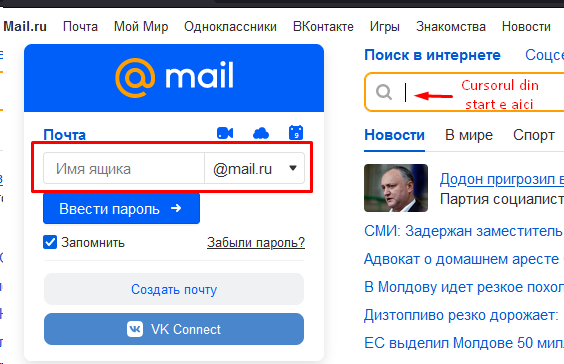
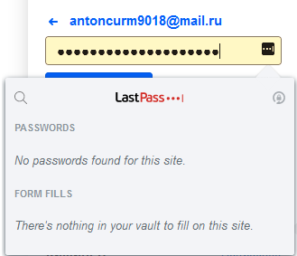
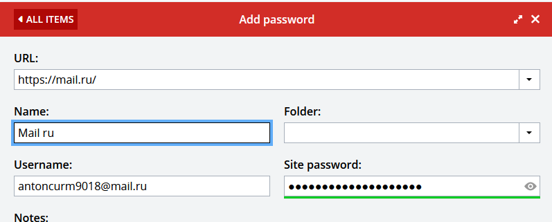
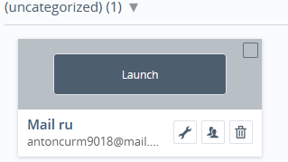
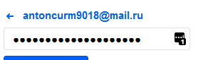

# Lucrarea de laborator Nr.1 la Securitatea SO

A elaborat: **Curmanschii Anton, IA1901**

## Sarcina

** Scopul lucrării:**
 
1. Studierea principiului de funcționare a sistemelor de management al parolelor (KeePass, eWallet, LastPass, 1Password). Analiza parametrilor de funcționare a lor. 
2. Descrierea comparativă a sistemelor de management al parolelor.
3. Descrierea principiului de funcționare a sistemului KeePass. Studierea funcționalității sistemului KeePass. Autentificarea la servicii diferite (Web şi aplicații) utilizând KeePass.

Remarcă: Descrierea comparativă a sistemelor de management al parolelor trebuie să se axeze pe următoarele principii: 

* Soft gratuit / licențiat / încorporat etc.,
* Varietatea sistemelor de operare / browser-elor cu care sunt compatibile,
* Varietatea serviciilor cu care sunt compatibile (aplicații Web etc.),
* Avantaje / dezavantaje,
* Interfața de lucru / lucru prin comenzi,
* Gradul de siguranță / riscul de a fi accesat de persoane neautorizate,
* Gradul de popularitate, (ce categorii de persoane le utilizează),
* Alte aspecte prin care se deosebesc, etc.

## KeePass

[Pagina web](https://keepass.info/).

* Soft întreg gratuit și open-source.
* Windows, Linux, Mac + datorită faptului că este open-source există porturi neoficiale pe Android, iOS.
* Poate deschide link-uri, rula comenzi.
* Interfața este intuitivă și simplă.
* Utilizează o parola master și criptează baza de date cu parolele sălvate cu AES, SHA-256 pentru compresarea cheii master.

### Modul de funcționare

[Informații despre securitatea](https://keepass.info/help/base/security.html)

Ideea este simplă:

* Toate datele utilizatorului sunt păstrate într-o bază de date.
* Baza de date este criptată cu un algoritm de criptare cu cheie simetrică (AES).
* Cheia pentru acest algoritm este derivată din parola master prin aplicarea unei funcții hash (SHA-256) și transformată pentru a preveni atacuri de dicționar (AES-KDF sau Argon2).
* Datorită faptului că criptăm cu cheia simetrică, aceeași cheie se utilizează și la criptare și la decriptare. Deci, având parola master, avem acces și contol total asupra bazei de date.

Fișierul bazei de date poate fi încărcat pe de exemplu google drive și utilizat de pe alte device-uri.
**Fără parola master, valoarea bazei de date este 0.** 

**Concluzia:** nivelul de securitate este mare, însă baza de date nu este automat salvată pe cloud. 
**Baza de date trebuie fi administrată manual de către utilizator.**

### Utilizarea parolelor

Zicem că utilizatorul vrea să utilizeze o parolă pentru a loga pe o pagină web.

Aici utilizatorul are mai multe posbilități.

Cea mai simplă variantă fără setup special este de copiat parolele necesare din baza de date, utilizând interfața grafică:

Problema cu această abordare este că ea este manuală, și eu de exemplu am un clipboard manager care ar copia aceste parole în istoria clipboard-ului.

Mai este posibil de setat placeholder-urile pentru variabilele într-un link, care vor fi substituite la login-uri sau la parole. 
Aceasta deja se diferă între site-uri specifice și nu este ușor pentru un utilizator obișnuit.
[Mai multă informație](https://keepass.info/help/base/autourl.html).

Mai este posibil de setat o serie de apasări a cheilor, [vedeți aceasta](http://www.geeksengine.com/article/keepass-5.html), însă această modalitate este și mai avansată și mai specifică pentru fiecare site.
De exemplu pentru site-ul din tutorial combinația `{USERNAME}{TAB}{PASSWORD}{ENTER}` este de ajuns, însă uitați-vă de exemplu la imaginea interfeței `mail.ru` sau `fincompay.com` de mai jos.
Deci ilustrez faptul că workflow-ul nu este același pentru orice site. 
Site-urile exemplificate au introducerea parolei pe o subpagină separată.

**Concluzia:** posibilități sunt multe, însă dizavantajul este că trebuie fi setate manual. 
**Nu furnizează integrarea bună cu browser-ul**. 
[HTML autocomplete](https://developer.mozilla.org/en-US/docs/Web/HTML/Attributes/autocomplete) nu este suportat după înțelegerea mea.

### Interfața

Totul a fost intuitiv, doar las aici [tutorialul](https://keepass.info/help/base/firststeps.html) și unele screenshot-uri.

### Lucrul prin comenzi

[Informațiile](https://keepass.info/help/base/cmdline.html).

Comenzile pot doar starta/termina interfața. 
Nu este clar dacă este posibil selectarea unelor date din baza de date.

[Permite dezvoltarea plugin-urilor în C#](https://keepass.info/help/v2_dev/plg_index.html).

## eWallet

[Pagina web](https://www.iliumsoft.com/ewallet/).

* Windows, MacOS, Linux, Android, iOS.
* Plătit (20$).
* Include aceleași capacități ca și KeePass: generarea parolelor, o bază de date criptată.
* Include sincronizarea cloud (KeePass nu a avut aceasta).
* Pare că are [integrarea mai bună cu browser-ul](https://www.iliumsoft.com/dl/doc/eWallet%20for%20Windows.pdf#page=24&zoom=auto,-91,355).
* Pare că nu are integrarea cu terminalul (n-am găsit aceasta în [manualul](https://www.iliumsoft.com/dl/doc/eWallet%20for%20Windows.pdf)).
* Interfața asemănător de intuitivă ca și la KeePass, iconițele sunt mai largi (probabil bine pentru persoanele cu viziune slabă).

## LastPass

[Pagina web](https://lastpass.com).

* Rulează în browser; Android, iOS.
* Gratuit (capacități limitate), Premium este 36$ anual.
* Păstrată numai pe cloud-ul lor. Baza de date nu poate fi descărcată în formatul criptat (însă permite descarcarea unui csv cu parolele decriptat).
* Include generarea parolelor și criptarea cu AES.
* Integrarea cu browser-ul este mai bună (clar, este o aplicație web).
* Interfața tot este simplă.

Unica problemă care eu am observat că aplicația este prea lentă. 
Este clar că e în browser și va fi necesar mai lentă, însă este prea lentă în unele cazuri.
Dacă apăsați `Account Settings`, de exemplu, trebuie să așteptați 5 secunde ca fereastra corespunzătoare să apară.

Integrarea cu câmpurile pentru parole pe pagini web este bună.
Programul rulează ca o extensiune pentru browser.

**Concluzia:** Introduce parolele stocate aproape atât de bine ca însăși browser-ul, dar le mai criptează. 
Parolele sunt stocate pe cloud-ul lor, ce este mai convenabil de utilizat.
Este integrarea automată pe diferite device-uri (vă logați, și deja aveți parolele).
Însă interfața este prea lentă în unele cazuri.

## 1Password

[Pagina web](https://1password.com/).

* Plătit (36$ anual).
* Rulează în browser; Windows, MacOS, Linux, Android, iOS.
* Integrarea cu câmpurile parolelor și login-urilor în browser.
* Cea mai user-friendly după opinia mea.
* Destinată mai mult companiilor pentru protecția parolelor.
* Criptarea parolelor cu AES, parola master criptează și decriptează parolele, ca și în aplicațiile precedente.
* API Integrarea excelentă pentru dezvoltatori.
* Sincronizarea automată.

**Concluzia:** Mai mult orientat la companii, însă pare ușor de utilizat și pentru un utilizator obișnuit.
Este foarte asemănător cu LastPass, dar mai are variantele aplicațiilor desktop.

> Dacă suprapun cu librăriile GUI: îmi pare că KeePass este ca GTK, 1Password ca Qt, iar LastPass ca Electron.

## Concluziile

Din aceste 4 ar utiliza LastPass, deoarece este gratuit și rulează în browser. 
Noi utilizăm parolele cel mai des în browser.

KeePass tot este gratuit și în principiu are mai multe capacități și este mai flexibil, însă nu este tare comod, din punct de vedere că nu are sincronizare și totul trebuie să fie setat manual.

Între eWallet și 1Password aș selecta 1Password, deoarece îmi pare că are mai multe capacități și mai multă documentare.

Toate aplicațiile lucrează pe baza aceluiași principiu, descris la KeePass, utilizând o parolă master și criptând parolele cu AES.
