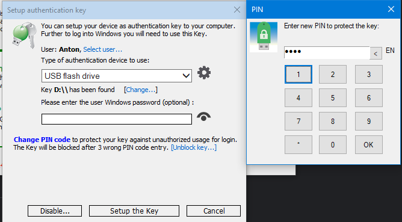

# Lucrarea de laborator Nr.3 la Securitatea SO

Tema: **Autentificare bazată pe mai mulţi factori**.

A elaborat: **Curmanschii Anton, IA1901**

- [Lucrarea de laborator Nr.3 la Securitatea SO](#lucrarea-de-laborator-nr3-la-securitatea-so)
  - [Scopul lucrării](#scopul-lucrării)
  - [Introducere](#introducere)
  - [Token de securitate](#token-de-securitate)
    - [Descriere](#descriere)
    - [Setarea](#setarea)
  - [One-Time Password (OTP)](#one-time-password-otp)
    - [Introducere](#introducere-1)
    - [Setarea de email OTP în Rohos](#setarea-de-email-otp-în-rohos)
    - [RSA SecurID](#rsa-securid)
    - [McAfee One Time Password Server](#mcafee-one-time-password-server)
  - [Single sign-on (SSO)](#single-sign-on-sso)
    - [Introducere](#introducere-2)
    - [OpenID vs Windows Live ID](#openid-vs-windows-live-id)
  - [Concluzii](#concluzii)

## Scopul lucrării

* Crearea unui token de securitate utilizând Rohos Logon Key, (Rohos face Logon). 
  Autentificarea Windows utilizând token-ul de securitate creat. 
* Soluția One-Time Password. Descrierea comparativă a sistemelor OTP (RSA SecurId, McAfee One Time Password Server etc.). 
  Standardul RFC 4226 (HOTP). 
* Soluția Single Sign On. Diferenţa dintre OpenID şi Windows Live ID.

## Introducere

Autentificarea bazată pe mai mulți factori înseamnă utilizarea simultană de a două sau mai multe modalități de logare pentru a putea autentifica utilizatorul, precum:

* Login + Parola clasică;
* Token-ul de securitate;
* Parola de singură utilizare (OTP).

Cu mai multe modalități care trebuie să fie utilizate împreună pentru a se autentifica, crește securitatea sistemei.
Dacă o metodă a fost compromizată, prezența și trebuința celeilalte metode nu-i va permite să primească accesul la sistem. 

## Token de securitate

### Descriere

Este un fel de hard disk, de exemplu un stick, care conține o modalitate de autentificare (fie parola sau o cheie criptografică), și poate fi utilizată pentru a-l loga în sistem. 
Unele soluții sunt dotate cu scaneri fizice de amprentă digitală (autenticarea biometrică), sau un mod de păstrate a parolei mai securizate, ca ea să nu poată fi extrasă dacă adversarul deține token-ul.

**Avantajele:** este comod de utilizat, deoarece nu trebuie să țineți minte parola, însă trebuie să purtați mereu acest token.

**Dezavantajele:** adversarul, dacă obține token-ul, poate să se autentifice în sistem.

### Setarea

Cel mai ușor pentru un utilizator obișnuit este de setat token-ul de securitate pe un stick, utilizând programul **Rohos Logon**.

Lucrează astfel, după cum am înțeles:

* Utilizatorul generează și încarcă date cifrate pe un stick, sau pe un device specializat. Aceste date vor fi utilizate pentru a autentifica utilizatorul;
* Programul Rohos instalează dll-urile sale în mapa vizibilă de sistem;
* Windows încarcă dll-urile la startup. Dll-urile furnizează funcționalitatea de login (se uită la stick-urile conectate, verifică dacă unul dintre ele conține cheia, verifică cheia utilizând funcții criptografice);

Nu știu cum anume este implementată interfața de login, presupun că Windows are API-uri pentru aceste interacțiuni.

Instalăm Rohos Logon, intrăm în opțiuni. Aici specificăm *USB Flash Drive*.

Acum introducem stick-ul. În Rohos selectăm *Setup authentication key* și selectăm stick-ul.

Dacă ieșim la ecran de logare, vedem opțiunea nouă între utilizatori: *Login by the key*. O apasăm.

Acum dacă introducem stick-ul, Windows îl primește în loc de parolă.

## One-Time Password (OTP)

### Introducere

One-Time Password (OTP) implică trimiterea unei parole temporare pe un alt device ce utilizatorul posedă: ori pe email, ori pe SMS, ori generarea ei prin algoritme criptografice.
Principalul este ca sistemul să știe parola dată împreună cu utilizatorul, pentru a o putea valida.
Parola, cum este clar din denumirea metodei, este de unica utilizare.

Cele mai interesante sunt parolele generate utilizând algoritme criptografice.

Primul algoritm este *HMAC-based one-time password (HOTP)*, unde și serverul (calculatorul) ce autentifică, și aplicația de pe smartphone al utilizatorului generează un cod care este utilizat la autentificare, pe baza unui contor sincronizat.

În HOTP, serverul incrementează contorul numai atunci când utilizatorul se loghează cu succes.
Serverul presupune că există doar un singur utilizator, adică parola corectă va fi generată numai de un singur utilizator.
Dacă utilizatorul a generat din greșeală mai multe parole, serverul va încerca hash-uri pentru mai multe contori consecutive (zicem, 100 max), găsind hash-ul corect undeva printre ele.
Vedeți și [linkul](https://www.rfc-editor.org/rfc/rfc4226#section-7.4).

Există și o altă abordare, algoritmul *Time-based one-time password (TOTP)*, unde în loc de contor se folosește timpul curent, care nu are această problemă de resincronizare, însă are problema de găsirea timpului curent.
Capacitatea de a cunoaște timpul curent este de obicei [implementată în hardware](https://whatis.techtarget.com/definition/real-time-clock-RTC) prin utilizarea [unui cristal de cuarț ce oscilează cu o frecvență foarte mare](https://www.wikiwand.com/en/Real-time_clock#/Timing), sau prin internet.
Aici, parolele au lungimea de viață scurtă, setată la un număr de secunde constant.

**Avantajul** așa parolelor este că ele pot fi simple și scurte, deoarece sunt generate din nou de fiecare dată. 
De obicei, ele sunt de 6 cifre zecimale. Atacuri DoS sunt prevenite de obicei prin limitarea numărului de încercări, și aplicarea unui throttle (utilizatorul trebuie să aștepte un timp între încercări consecutive, care crește liniar, dacă el face o greșeală). 
Evident, este protejat de atacuri de reluare.

**Dezavantajul** este că, ca și la parole obișnuite, evident, persoana care deține cheia secretă utilizată la generarea parolelor (și contorul curent aproximativ, în cazul lui HOTP), poate să se autentifice. 
Sunt vulnerabile la atacuri man-in-the-middle, deoarece adversarul, dacă poate bloca utilizatorul de a loga în sistem, după ce el a introdus parola corectă, poate utiliza acea parolă pentru a loga el singur. 

### Setarea de email OTP în Rohos

Am încercat să setez această modalitate de autentificare fără mult succes, după [următorul guide](https://www.rohos.com/2017/08/25/how-to-setup-2-factor-authentication-with-one-time-passwords-delivered-by-email/):

* Utilizatorul dă email-ul său la sistem la setarea metodei;
* Utilizatorul modifică script-ul PowerShell care va fi executat când utilizatorul cere o parolă (specifică contul de pe care se vor transmite mesajele);
* Acum, la meniu de logare trebuie să apare un box pentru așa parolă, împreună cu un buton ce ar rula script-ul, transmitând parola pe email.

La mine boxa apărea, însă butonul nu era prezent. 
Probabil, configurarea a ieșit cumva incorectă, deoarece o altă modalitate de a genera așa parole este serviciul **Google Authenticator**, care nu necesită ca calculatorul să trimită mesajele, însă necesită în loc de aceasta instalarea unei aplicații pe smartphone, implementând algoritmele HOTP și TOTP.

Deci, pentru a seta autenticarea cu parole de singură utilizare transmise pe email:

* Am intrat în meniul *Setup OTP token*, bifând *By email or SMS* și introducând email-ul meu:

  

  

* Am creat un cont pe gmail de pe care se vor transmite mesaje, *anton.curm.test@gmail.com*. 
  Am setat opțiunea *Allow less secure apps* în setările contului.

  

* Am permis executarea script-urilor PowerShell în consolă pe 64 și pe 32 de biți.

  

* Am modificat fișierul *OtpDeliveryScript.ps1*, adaugând datele de logare.

  

* Am testat script-ul, executând-ul în consolă.

  

* Am testat mai multe opțiuni, ca *Require 2FA for listed users (Anton)*, am debifat *Disable 2FA in Credential UI Prompt* în *More...* în Opțiuni.
  
  

  

Aceasta cu părere de rău nu a lucrat. 
Cum am zis, meniul de logare nu conținea butonul de trimitere a unei parole noi, iar fără stimulare cu totul nu trimitea parola.

Încă un lucru care așa și nu s-a clarificat la mine: oare Rohos va genera o parolă automat, sau trebuie să setez eu o soluție terță parte manual? 

### RSA SecurID

Este generator de parole fizic. 
Este bazat pe algoritmul TOTP, adică utilizează un ceas sincronizat și o cheie din care este generată parola.
Este de obicei utilizat de organizații care au nevoie de o soluție securizată de parole de singură utilizare.

Același set de dezavantaje și avantaje se aplică și la acest device.

### McAfee One Time Password Server

Este o soluție OTP care lucrează cu *push notifications*, transmitând parolele de singură utilizare pe SMS.
Soluția este orientată la companii mari, asigurează ușurința de setare, scalabilitatea și integrarea ușoară în sisteme de autentificare existente. 

## Single sign-on (SSO)

### Introducere

Single sign-on semnifică utilizarea unei singure parole asigură accesul la mai multe surse legate.
Esența este că toate aceste resurse ar folosi un singur serviciu de logare, deci parola va fi stocată numai într-un singur loc.

**Avantajele** sunt că parolele sunt stocate într-un singur loc, deci sunt mai protejate, deoarece se minimizează numărul de locuri unde pot fi expuse. 
Nu forțează utilizatorul să creeze mai multe parole diferite pentru fiecare serviciu, astfel eliminând situații când utilizatorii sunt nevoiți să-și scrie parolele pe hârtie ca să nu le memorizeze, și parolele făcute slabe special ca să fie mai ușoare de memorizat.

**Dezavantajele** sunt că dacă adversarul află parola, el primește acces la mai multe resurse deodată.

### OpenID vs Windows Live ID

OpenID este o soluție SSO open source pe care diferite site-uri o pot utiliza pentru a implementa autentificarea.

Windows Live ID este o soluție proprietară a lui Microsoft care este utilizată pentru aplicațiile lor diferite, precum Outlook, Skype, Office etc.

## Concluzii

În lucrare am prezentat modalitățile autentificării băzate pe mai mulți factori, am demonstrat utilizarea softului Rohos pentru a transforma un stick într-un token de securitate, am descris cum funcționează algoritmii *one-time password*, am definit modalitatea de *single sign-on*.