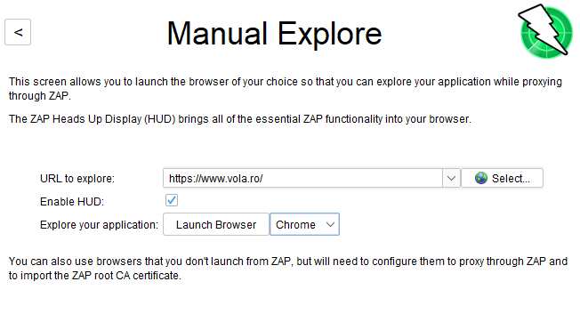

# Lucrarea de laborator Nr.5 la Securitatea SI

Tema: **Instrumente de scanare a vulnerabilităţilor. OWASP ZAP.**

A elaborat: **Curmanschii Anton, IA1901**

- [Lucrarea de laborator Nr.5 la Securitatea SI](#lucrarea-de-laborator-nr5-la-securitatea-si)
  - [Sarcini](#sarcini)
  - [Despre OWASP ZAP](#despre-owasp-zap)
  - [ZAP](#zap)
    - [Executarea 1](#executarea-1)
    - [Executarea 2](#executarea-2)
  - [Alte aplicații pentru testarea securității web](#alte-aplicații-pentru-testarea-securității-web)
  - [Concluziile](#concluziile)

## Sarcini

1. Sa se utilizeze instrumentele OWASP pentru scanarea vulnerabilităţilor la aplicaţiile web  
(2-3 aplicaţii web).  
2. Determinaţi care sunt vulnerabilităţile întâlnite si descrieţi in ce constau ele. 
3. Care sunt metodele de soluţionare ale acelor probleme care sunt provocate de anumite 
vulnerabilităţi? 
4. Determinaţi alte aplicaţii pentru scanarea vulnerabilităţilor pentru aplicaţii web şi faceţi o analiză 
comparativă a lor.

## Despre OWASP ZAP

Zed Attack Proxy (ZAP) este un instrument open source și gratuit pentru testarea de penetrare.
Este dezvoltat ca o parte a proiectului OWASP, destinat atingerii securității web.
ZAP este desemnat în special testării aplicațiilor web.

ZAP este de fapt un proxy man-in-the-middle. 
El șede între browser și aplicația web, interceptează și inspectează mesajele, potențial le modifice, și le transmite la distinație. 
Poate fi utilizat ca o aplicație stand-alone sau ca un proces background.

Scopul utilizării lui ZAP constă în găsirea vulnerabilităților aplicației date.

ZAP are regim simplu automat, dar are și mai multe capacități pentru profesioniști.

## ZAP

Mă orientez după [această pagină getting started](https://www.zaproxy.org/getting-started/).

Rularea inițială:

Meniul principal:

### Executarea 1

Am decis să fac un test automat asupra site-ului https://dotnetfiddle.net.

Testul a reușit să descopere o mulțime de vulnerabilități, dar l-am oprit imediat după ce a apărut primele vulnerabilități grele, ca să nu încarc serverul lor.

Vulnerabilitățile conțin descrieri, variante posibile de soluționare, precum și link-uri la resurse cu descrieri mai detaliate.

Printre problemele găsite:

1. Folosirea librăriilor învechite care conțin vulnerabilități.
2. Frame-uri incluse nu au fost limitate doar la originea site-ului (xframe).
3. Lipsa tokenurilor Anti-CSRF (vulnerabilitatea posibilă XSS).
4. Lipsa flagurilor de securitate în cookie (HttpOnly, Secure, SameSite).
5. Scurgerea de date despre server în antete (versiunea lui AspNet, timestamp-uri).

Soluționarea primei probleme este utilizarea versiunii noi a librăriei, iar în celelalte cazuri simple trebuie să adauge (șterge) careva flaguri sau informații.

### Executarea 2

Voi testa aplicația web https://www.vola.ro/.

Aici am folosit modul de funcționare semi-manual. 
Spider-ul care descoperă pagini tot este creat, dar utilizatorul poate să-l ajută, de exemplu, prin trecerea la link-uri care nu au putut fi găsite de spider, sau îndeplinirea formelor.
Nu am utilizat foarte mult aceste funcționalități, am intrat pe niște pagini și am apăsat butoane cu linkuri, și am oprit testarea, pentru a nu supraîncărca serverul, iarăși.

Printre problemele găsite:

1. Posibila supraîncărcare de server din cauza folosirii script-src și object-src 'none'. Aceasta parcă este ceva legat la împărțirea datelor media.
2. 'script-src' are 'unsafe inline'. Este ceva legat la executarea numai scripturilor cu hash-ul din lista hashurilor permise. 
Am citit și documentarea, dar totuși nu înțeleg de ce el se plânge.
3. Cross Origin Resource Sharing (CORS) este permis pe întregul site. Acesta dezvolatorii au făcut probabil pentru comoditate, deoarece împărțirea datelor atunci devine mai ușoară. Soluția este de creat whitelistul domain-urilor permise.
4. Folosirea unei librării javascript vulnerabile.
5. Aceeași problemă cu xframe.
6. Aceleași probleme cu flagurile cookie.
7. Aceeași problemă cu scurgerea datelor despre server.

## Alte aplicații pentru testarea securității web

Interpretez informația de pe [acest site](https://resources.infosecinstitute.com/topic/14-popular-web-application-vulnerability-scanners/).

**Grabber**

- Este lentă, fiind programată în Python.
- Are mai puține capacități, dar este bună pentru testarea aplicațiilor web mici. Nu este bună pentru aplicații profesionale.
- Nu are o interfață grafică, produce PDF-uri.

**Vega**

După descrierea din articol, oferă capacități asemănătoare cu ZAP: o interfacă grafică, proxy man-in-the-middle, caută și raportează vulnerabilități.

**Wapiti**

- O aplicație în linie de comandă.
- Performă multiple verificări pentru a găsi vulnerabilități.
- Lucrează prin scanarea paginilor și injectarea datelor pentru a testa scripturile.
- Aplicația are multe funcții, este recomandată pentru profesioniști.

## Concluziile

Utilizăm testarea de penetrare pentru a găsi diferite vulnerabilități în aplicații Web.
Pentru acest lucru putem folosi instrumente open-source, ca OWASP ZAP.
El găsește vulnerabilități în aplicația noastră și le raportează; oferă soluții posibile și dă linkuri la informații mai detaliate despre problemele găsite.